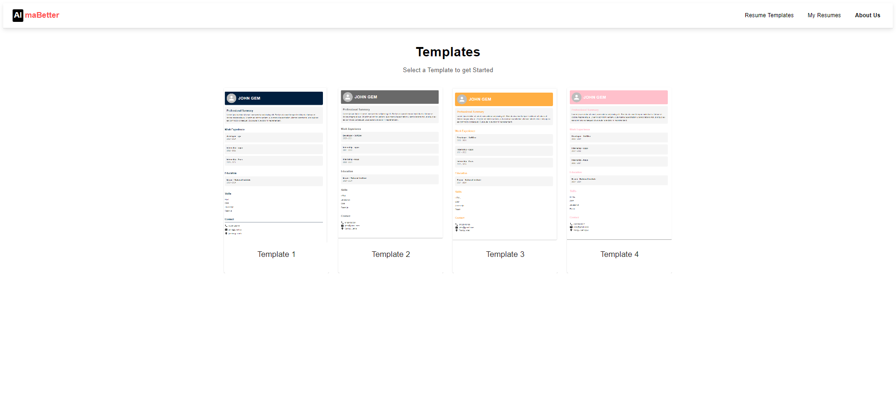

# Resume Builder

### Summary
The **Resume Builder** is a web application designed to streamline the process of creating professional resumes. Users can easily input their personal information, education, experience, and skills to generate a polished, ready-to-download resume in PDF format. The application is built using React.js for a dynamic user interface, Redux for state management, and Material UI for sleek, responsive design components. With a focus on user experience, the Resume Builder includes features like form validation, step-by-step navigation, and template selection to ensure that users can create a resume that suits their needs with minimal effort.

The project demonstrates a comprehensive approach to modern web development, utilizing React's component-based architecture and Redux for efficient state management. The application is fully responsive, ensuring usability across different devices, and is deployed using Netlify for easy access.

[View the GitHub Repository](https://github.com/UmeraGhori/resume-builder.git)

## Features
- User-friendly interface with step-by-step navigation
- Multiple resume templates to choose from
- Real-time preview of the resume
- PDF download functionality
- Form validation for accurate data entry

## Technologies Used
- React.js
- Redux
- Material UI
- jsPDF
- Netlify (for deployment)

## Installation
1. Clone the repository: `git clone https://github.com/yourusername/resume-builder.git`
2. Navigate to the project directory: `cd resume-builder`
3. Install dependencies: `npm install`
4. Run the application: `npm start`

## Usage
1. Open the application in your browser.
2. Select a resume template.
3. Fill in the required details (personal information, education, experience, skills).
4. Preview your resume in real-time.
5. Download the resume as a PDF.

## Contributing
Contributions are welcome! Please open an issue or submit a pull request with your changes.

## License
This project is licensed under the MIT License.

